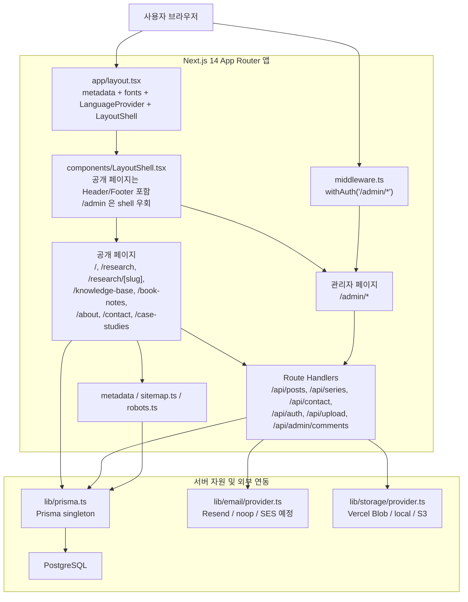
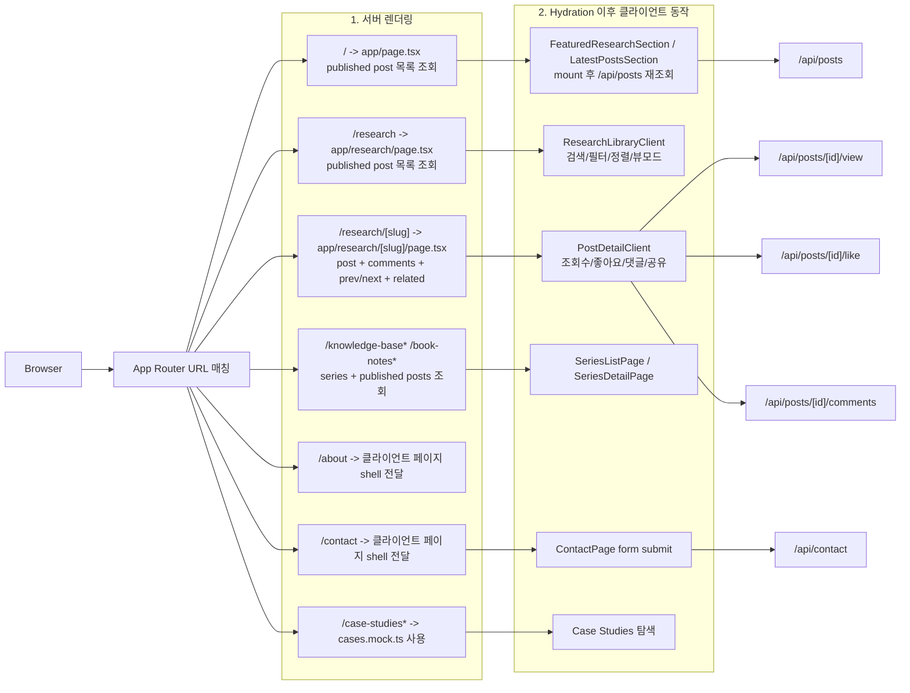
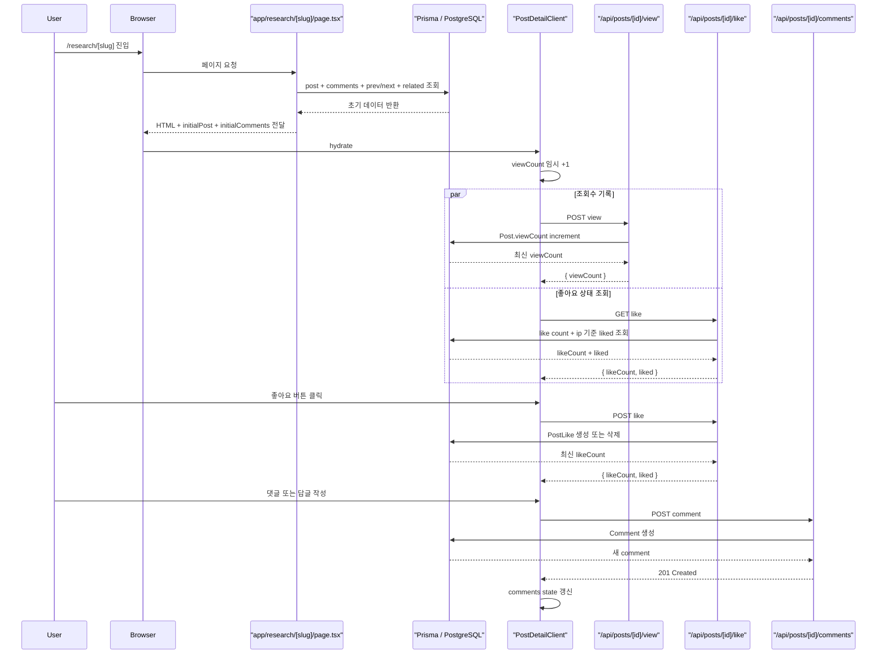
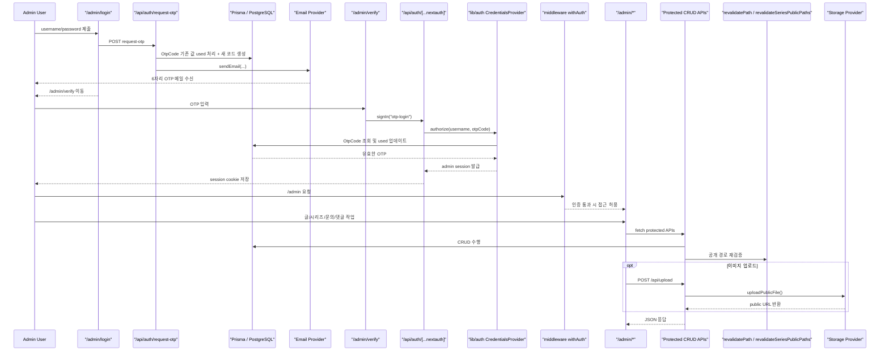

# 현재 웹사이트 실행흐름과 설계도

이 문서는 `/Users/jaehkim/Documents/GitHub/jaehkim-research-site`의 현재 구현을 기준으로 웹사이트의 실행 흐름과 시스템 설계를 정리한 문서입니다. 초기 기획 문서가 아니라 실제 코드에 존재하는 페이지, 컴포넌트, API 호출, DB/이메일/업로드 연결을 기준으로 작성했습니다.

## 1. 핵심 요약

- 프레임워크는 `Next.js 14 App Router`이며, 공개 사이트는 서버 컴포넌트와 클라이언트 컴포넌트를 혼합해 사용합니다.
- 핵심 콘텐츠 저장소는 `Prisma + PostgreSQL`이고, 공개 콘텐츠의 대부분은 서버 컴포넌트가 직접 Prisma를 호출해 렌더링합니다.
- 사용자 상호작용은 Route Handler가 담당합니다. 대표적으로 조회수, 좋아요, 댓글, 문의, 업로드, 관리자 CRUD가 여기에 속합니다.
- 관리자 영역은 `NextAuth CredentialsProvider + OTP` 기반이며, `middleware.ts`가 `/admin/*` 접근을 보호합니다.
- 파일 업로드는 환경변수에 따라 `Vercel Blob` 또는 `public/uploads` 로컬 저장소를 사용하고, 이메일 발송은 `Resend` 또는 `noop` 모드로 분기됩니다.

## 2. 시스템 컨텍스트

- 시작 주체: 사용자는 브라우저에서 공개 경로 또는 `/admin/*` 경로를 요청합니다.
- 렌더링 위치: 전체 앱은 `app/layout.tsx` 아래에서 시작하고, 공개 페이지는 `LayoutShell`을 거쳐 `Header/Footer`가 포함되며, 관리자 페이지는 `LayoutShell`에서 별도 shell 없이 바로 렌더링됩니다.
- 데이터 저장 위치: 콘텐츠와 관리자 관련 상태는 PostgreSQL에 저장되고, Prisma가 공통 데이터 접근 계층 역할을 합니다.
- 후속 호출: 공개 페이지는 서버 컴포넌트에서 Prisma를 직접 읽거나, 클라이언트 hydrate 이후 Route Handler를 호출합니다. 관리자 페이지는 대부분 클라이언트에서 보호된 API를 호출합니다.
- 재검증 지점: `POST/PUT/DELETE` 성격의 콘텐츠 API는 `revalidatePath` 와 `revalidateSeriesPublicPaths` 를 호출해 홈, 리서치, 상세, 시리즈, 사이트맵 경로를 갱신합니다.

기획 대비 현재 구현:

- 문서/검증/성과 대시보드 중심의 IA가 제안되어 있었지만, 실제 메인 내비게이션은 `Home`, `Research`, `Knowledge Base`, `Book Notes`, `About`, `Contact` 중심입니다.
- `sitemap.ts` 와 `robots.ts` 는 구현되어 있지만, 공개 정보구조는 기획서보다 더 “리서치 라이브러리 + 시리즈 + 관리자 CMS” 중심으로 수렴되어 있습니다.

## 3. 공개 사이트 실행 흐름

- 시작 주체: 공개 사이트의 흐름은 URL 요청으로 시작되며, App Router가 페이지별 서버 컴포넌트를 선택합니다.
- 렌더링 위치: 홈, 리서치 라이브러리, 리서치 상세, 시리즈 페이지는 서버 컴포넌트가 Prisma로 데이터를 읽어 HTML을 먼저 만듭니다. 반대로 `about`, `contact` 는 데이터 의존성이 낮아 클라이언트 UI 중심으로 동작합니다.
- 데이터 저장 위치: 홈/라이브러리/상세/시리즈는 PostgreSQL의 `Post`, `Series`, `Comment`, `PostLike` 데이터를 읽고, `case-studies` 는 `lib/research/data/cases.mock.ts` 의 정적 mock 데이터를 사용합니다.
- 후속 호출: 홈의 `FeaturedResearchSection`, `LatestPostsSection` 은 초기 props를 받아도 mount 후 `/api/posts` 를 다시 호출합니다. 리서치 라이브러리는 보통 서버 초기 데이터를 사용하지만, `initialPosts` 가 비어 있을 때만 `useResearchLibraryState` 가 `/api/posts` fallback fetch 를 수행합니다. 리서치 상세는 hydrate 후 조회수/좋아요/댓글 API를 호출하고, `contact` 는 `POST /api/contact` 로 문의를 저장합니다.
- 재검증 지점: 공개 페이지 자체는 읽기 중심이지만, 해당 페이지들이 참조하는 데이터는 관리자 API에서 갱신될 때 재검증됩니다.

기획 대비 현재 구현:

- 홈 화면에 `Hero`, `Featured`, `Latest`, `Newsletter` 는 연결되어 있지만, `SocialProofSection`, `ValidationPrinciplesSection`, `ToolsTemplatesSection` 컴포넌트는 현재 `app/page.tsx` 에서 마운트되지 않습니다.
- `Methodology`, `Evidence`, `Categories` 와 같은 전용 정보구조는 아직 별도 공개 라우트로 구현되지 않았습니다.
- `/dashboard` 와 `/subscribe` 페이지는 존재하지만 헤더 내비게이션에 연결되지 않은 별도 프로토타입 상태입니다.

## 4. 포스트 상세 상호작용 시퀀스

- 시작 주체: 사용자가 특정 리서치 상세 URL에 진입하면 서버 컴포넌트가 먼저 본문과 댓글, 인접 글, 관련 글을 준비합니다.
- 렌더링 위치: `app/research/[slug]/page.tsx` 가 초기 데이터를 조립하고, 이후 `PostDetailClient` 가 상호작용 상태를 소유합니다.
- 데이터 저장 위치: 본문과 메타는 `Post`, 좋아요는 `PostLike`, 댓글과 답글은 `Comment` 모델에 저장됩니다.
- 후속 호출: hydrate 직후 `POST /view` 와 `GET /like` 가 자동 호출되고, 사용자가 버튼을 누르면 `POST /like`, `POST /comments` 가 이어집니다. TOC 추출, 읽기 시간 계산, 공유 링크 복사는 클라이언트 내부 계산 또는 브라우저 API로 처리됩니다.
- 재검증 지점: 조회수/좋아요/댓글 API 자체는 경로 재검증을 하지 않으며, 이 값들은 동적 상호작용으로 페이지 상태를 갱신합니다.

기획 대비 현재 구현:

- 기획 문서의 “Summary / Deep Dive 탭”은 실제로 탭 전환 UI가 아니라, 동일 화면 안에서 요약 박스와 Markdown 본문 영역을 순차적으로 보여주는 구조입니다.
- 상세 페이지는 댓글과 공유 기능까지 포함해 기획보다 상호작용 범위가 넓습니다.

## 5. 관리자/CMS 실행 흐름

- 시작 주체: 관리자 흐름은 `/admin/login` 에서 사용자명과 비밀번호를 제출하는 순간 시작됩니다.
- 렌더링 위치: 인증 이전에는 `app/admin/layout.tsx` 가 로그인/인증 페이지를 그대로 노출하고, 인증 이후에는 `SessionProvider` 아래의 관리자 shell 과 각 페이지가 렌더링됩니다.
- 데이터 저장 위치: OTP는 `OtpCode`, 문의는 `ContactInquiry`, 글은 `Post`, 시리즈는 `Series`, 댓글은 `Comment` 에 저장됩니다. 업로드 파일은 환경설정에 따라 Vercel Blob 또는 `public/uploads` 로 저장됩니다.
- 후속 호출: 관리자 대시보드와 편집 화면은 대부분 클라이언트 fetch 로 `/api/posts`, `/api/series`, `/api/contact`, `/api/admin/comments`, `/api/upload` 를 호출합니다. 각 보호된 API는 `getServerSession(authOptions)` 로 세션을 검사합니다.
- 재검증 지점: 글/시리즈 생성, 수정, 삭제 시 홈, 리서치 목록, 상세, 사이트맵, 시리즈 상세 경로를 재검증해 공개 페이지가 최신 상태를 반영하게 합니다.

기획 대비 현재 구현:

- 현재 사이트는 단순 블로그 관리가 아니라 `Posts`, `Series`, `Inquiries`, `Comments` 를 모두 다루는 내부 CMS 형태로 확장되어 있습니다.
- OTP는 이메일 발송이 실패하면 로그인 흐름도 중단되므로, 관리자 인증이 이메일 provider 설정에 강하게 의존합니다.

## 6. 페이지와 모듈 책임 매핑

### 6-1. 공개 페이지

| 영역 | 대표 경로/파일 | 역할 | 데이터 소스 | 비고 |
| --- | --- | --- | --- | --- |
| 루트 레이아웃 | `app/layout.tsx` | 메타데이터, 폰트, `LanguageProvider`, `LayoutShell` 초기화 | 환경변수 | 전체 앱 공통 진입점 |
| 공개 shell | `components/LayoutShell.tsx` | 공개 페이지에 `Header/Footer` 부착, `/admin` 예외 처리 | `usePathname()` | admin 은 shell 우회 |
| 홈 | `app/page.tsx` | 최근 공개 포스트를 불러와 Hero/Featured/Latest/Newsletter 조립 | `Post` | 일부 섹션은 hydrate 후 재조회 |
| 리서치 라이브러리 | `app/research/page.tsx`, `app/research/ResearchLibraryClient.tsx` | 포스트 목록 제공, 검색/필터/정렬/페이지네이션 | `Post` | 서버 초기 데이터 + 클라이언트 상태 |
| 리서치 상세 | `app/research/[slug]/page.tsx`, `PostDetailClient.tsx` | 본문, 댓글, 관련 글, 상호작용 제공 | `Post`, `Comment`, `PostLike` | 조회수/좋아요/댓글 API 호출 |
| 시리즈 목록/상세 | `app/knowledge-base/*`, `app/book-notes/*`, `components/series/*` | `Series` 기준 묶음 제공 | `Series`, `Post` | 상세의 각 chapter 는 `/research/[slug]` 로 연결 |
| About | `app/about/page.tsx` | 프로필, 이력, focus 노출 | 번역 객체 | DB 사용 없음 |
| Contact | `app/contact/page.tsx` | 문의 폼 수집 | `ContactInquiry` | 제출 시 `/api/contact` 호출 |
| Case Studies | `app/case-studies/*` | 사례 목록/상세 노출 | `cases.mock.ts` | Prisma 미사용 |
| 프로토타입 페이지 | `app/dashboard/page.tsx`, `app/subscribe/page.tsx` | 성과 대시보드/구독 페이지 프로토타입 | 로컬 상수 | 헤더 내비게이션 미연결 |

### 6-2. 관리자 페이지

| 영역 | 대표 경로/파일 | 역할 | 주요 연동 | 비고 |
| --- | --- | --- | --- | --- |
| 관리자 레이아웃 | `app/admin/layout.tsx` | `SessionProvider` 와 관리자 내비게이션 제공 | `next-auth/react` | 로그인/검증 페이지는 shell 제외 |
| 로그인 | `app/admin/login/page.tsx` | username/password 검증 요청 | `POST /api/auth/request-otp` | 성공 시 username 을 `sessionStorage` 에 보관 |
| OTP 검증 | `app/admin/verify/page.tsx` | 6자리 OTP 입력 후 세션 발급 | `signIn("otp-login")` | 성공 시 `/admin` 이동 |
| 글 관리 | `app/admin/page.tsx`, `components/admin/PostList.tsx`, `PostForm.tsx` | 목록, 생성, 수정, 삭제, publish 토글 | `/api/posts*`, `/api/upload` | 자동 slug, draft 저장 포함 |
| 시리즈 관리 | `app/admin/series/*`, `components/admin/SeriesForm.tsx` | knowledge-base/book-notes series CRUD | `/api/series*` | 공개 경로 재검증과 연결 |
| 문의 관리 | `app/admin/inquiries/page.tsx` | 읽음 처리, 삭제, 답장 링크 제공 | `/api/contact*` | 읽지 않은 문의 count 표시 |
| 댓글 관리 | `app/admin/comments/page.tsx` | 전체 댓글 검토/삭제 | `/api/admin/comments*` | post/parent 정보 포함 |

### 6-3. 공통 라이브러리와 유틸

| 모듈 | 역할 | 사용 위치 | 비고 |
| --- | --- | --- | --- |
| `lib/prisma.ts` | Prisma singleton 생성 | 공개 페이지, API, sitemap | dev 환경 중복 연결 방지 |
| `lib/auth.ts` | NextAuth OTP CredentialsProvider 정의 | `api/auth/[...nextauth]`, middleware | 세션 maxAge 24시간 |
| `lib/email/provider.ts` | 이메일 provider 선택 및 발송 | OTP, contact 알림 | `ses` 는 차후 구현 대상 |
| `lib/storage/provider.ts` | 업로드 저장소 선택 | `/api/upload` | `s3` 업로드 구현 완료 |
| `lib/slug.ts` | slug 정규화와 변형 처리 | post/series CRUD, 상세 라우트 | NFC/NFD 호환 고려 |
| `lib/research/serializers.ts` | Prisma 결과를 클라이언트용 shape 로 변환 | 홈, 라이브러리, 시리즈 API | count 필드 정리 |
| `lib/research/postDetail.ts` | TOC, 읽기 시간, 관련 글 계산 | 리서치 상세 | 클라이언트/서버 보조 로직 |
| `lib/research/libraryFilters.ts` | 검색, 태그 필터, 정렬, pagination | 리서치 라이브러리 | purely client state |
| `lib/research/revalidatePublicPaths.ts` | 공개 경로 재검증 helper | post/series mutation API | 시리즈 type 별 상세 경로 계산 |
| `lib/i18n/*` | 번역 context와 문자열 제공 | 공개/관리자 UI 전반 | 현재 locale 은 `ko` 고정 |

## 7. API 요약

| 라우트 | 인증 | 주요 역할 | 저장/부수효과 |
| --- | --- | --- | --- |
| `GET /api/posts` | 선택적 | 공개 post 목록 조회, admin session + `all=true` 이면 unpublished 포함 | DB 읽기 |
| `POST /api/posts` | 필요 | post 생성 | DB 쓰기 + 홈/리서치/상세/시리즈/사이트맵 재검증 |
| `GET /api/posts/[id]` | 없음 | 단일 post 조회 | DB 읽기, admin edit 에서 사용 |
| `PUT /api/posts/[id]` | 필요 | post 수정, publish 토글 포함 | DB 쓰기 + 경로 재검증 |
| `DELETE /api/posts/[id]` | 필요 | post 삭제 | DB 쓰기 + 경로 재검증 |
| `POST /api/posts/[id]/view` | 없음 | 조회수 증가 | `Post.viewCount` 증가 |
| `GET /api/posts/[id]/like` | 없음 | 현재 IP의 좋아요 상태와 총 count 조회 | DB 읽기 |
| `POST /api/posts/[id]/like` | 없음 | 현재 IP 기준 좋아요 토글 | `PostLike` 생성/삭제 |
| `GET /api/posts/[id]/comments` | 없음 | 최상위 댓글과 답글 조회 | DB 읽기 |
| `POST /api/posts/[id]/comments` | 없음 | 댓글/답글 생성 | `Comment` 생성 |
| `DELETE /api/posts/[id]/comments/[commentId]` | 필요 | 특정 댓글 삭제 | `Comment` 삭제 |
| `GET /api/series` | 선택적 | 시리즈 목록 조회, admin session + `all=true` 이면 unpublished 포함 | DB 읽기 |
| `POST /api/series` | 필요 | series 생성 | DB 쓰기 + 시리즈 상세 재검증 |
| `GET /api/series/[id]` | 없음 | 단일 series 조회 | DB 읽기, posts 는 published 만 포함 |
| `PUT /api/series/[id]` | 필요 | series 수정 | DB 쓰기 + 이전/신규 경로 재검증 |
| `DELETE /api/series/[id]` | 필요 | series 삭제 | DB 쓰기 + 상세 경로 재검증 |
| `POST /api/auth/request-otp` | 없음 | 관리자 비밀번호 확인 후 OTP 생성/발송 | `OtpCode` 갱신 + 이메일 발송 |
| `GET/POST /api/auth/[...nextauth]` | 내부 | NextAuth session/credentials 처리 | 세션 쿠키 발급 |
| `GET /api/contact` | 필요 | 문의 목록 조회 | DB 읽기 |
| `POST /api/contact` | 없음 | 문의 생성 | `ContactInquiry` 생성 + 관리자 알림 메일 |
| `PATCH /api/contact/[id]` | 필요 | 문의 read 상태 변경 | DB 쓰기 |
| `DELETE /api/contact/[id]` | 필요 | 문의 삭제 | DB 쓰기 |
| `GET /api/admin/comments` | 필요 | 전체 댓글 조회 | DB 읽기 |
| `DELETE /api/admin/comments/[id]` | 필요 | 댓글 삭제 | DB 쓰기 |
| `POST /api/upload` | 필요 | 에디터 이미지 업로드 | 외부/로컬 저장소 쓰기 |

## 8. 데이터 모델 요약

| 모델 | 핵심 필드 | 주 사용처 | 비고 |
| --- | --- | --- | --- |
| `Post` | `title`, `slug`, `summary`, `content`, `tags`, `level`, `published`, `viewCount`, `seriesId`, `seriesOrder`, `date` | 홈, 리서치 라이브러리, 상세, 관리자 CMS | 콘텐츠의 중심 모델 |
| `Series` | `title`, `slug`, `description`, `type`, `level`, `published` | knowledge-base, book-notes, 관리자 CMS | `type` 으로 라우트 성격 구분 |
| `PostLike` | `postId`, `ip` | 상세 좋아요 | `@@unique([postId, ip])` 로 중복 방지 |
| `Comment` | `postId`, `parentId`, `name`, `content`, `createdAt` | 상세 댓글, 관리자 댓글 | 자기참조 relation 으로 답글 구성 |
| `OtpCode` | `code`, `expiresAt`, `used` | 관리자 OTP 인증 | 5분 만료, 사용 후 `used=true` |
| `ContactInquiry` | `purpose`, `name`, `email`, `subject`, `message`, `read` | contact, 관리자 문의함 | 공개 폼과 내부 inbox 연결 |

## 9. 기획 대비 현재 구현 차이

- 메인 공개 네비게이션은 `Methodology`, `Performance Dashboard`, `Subscribe` 대신 `Knowledge Base`, `Book Notes` 를 중심으로 구성되어 있습니다.
- `Social Proof`, `Validation Principles`, `Tools & Templates` 섹션 컴포넌트는 존재하지만 현재 홈 실사용 흐름에는 연결되지 않았습니다.
- `Case Studies` 는 여전히 mock 데이터 기반이며 CMS/DB 파이프라인으로 통합되지 않았습니다.
- `/dashboard`, `/subscribe` 는 프로토타입 페이지로 남아 있으며, 현재 운영 흐름의 핵심 라우트로 취급되지 않습니다.
- About 페이지는 윤리/면책 전용 섹션보다는 프로필과 경력 소개 중심으로 구현되어 있습니다.

## 10. 검증 근거

이 문서는 아래 실제 구현 지점을 기준으로 작성했습니다.

- 서버 컴포넌트의 Prisma 조회: `app/page.tsx`, `app/research/page.tsx`, `app/research/[slug]/page.tsx`, `app/knowledge-base/*`, `app/book-notes/*`, `app/sitemap.ts`
- 클라이언트 fetch 호출: `components/research/sections/FeaturedResearchSection.tsx`, `components/research/sections/LatestPostsSection.tsx`, `app/research/[slug]/PostDetailClient.tsx`, `components/research/CommentSection.tsx`, `app/contact/page.tsx`, `components/admin/*`, `app/admin/*`
- 인증과 권한 보호: `middleware.ts`, `lib/auth.ts`, `app/api/auth/request-otp/route.ts`, `app/api/auth/[...nextauth]/route.ts`
- 재검증과 공개 경로 갱신: `app/api/posts/route.ts`, `app/api/posts/[id]/route.ts`, `app/api/series/route.ts`, `app/api/series/[id]/route.ts`, `lib/research/revalidatePublicPaths.ts`

이 문서만 보면 다음 질문에 답할 수 있어야 합니다.

1. 첫 렌더링에서 어떤 페이지가 서버에서 DB를 직접 읽는가
2. hydrate 이후 어떤 클라이언트 컴포넌트가 어떤 API를 호출하는가
3. 관리자 인증이 어떤 단계로 세션을 발급하는가
4. DB, 이메일, 업로드 저장소가 어디에서 연결되는가
